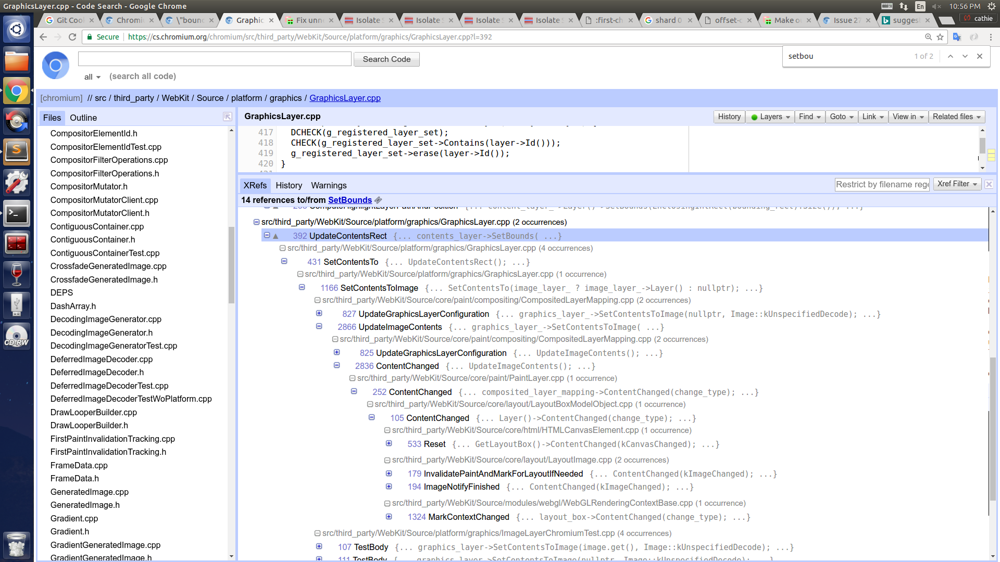

有点像堆栈，从下往上看：
```
	src/third_party/WebKit/Source/platform/graphics/GraphicsLayer.cpp	 	UpdateContentsRectcontents_layer->SetBounds(
	src/third_party/WebKit/Source/platform/graphics/GraphicsLayer.cpp	 	SetContentsToUpdateContentsRect();
	src/third_party/WebKit/Source/platform/graphics/GraphicsLayer.cpp	 	SetContentsToImageSetContentsTo(image_layer_ ? image_layer_->Layer() : nullptr);
	src/third_party/WebKit/Source/core/paint/compositing/CompositedLayerMapping.cpp	UpdateGraphicsLayerConfigurationgraphics_layer_->SetContentsToImage(nullptr, Image::kUnspecifiedDecode);
	src/third_party/WebKit/Source/core/paint/compositing/CompositedLayerMapping.cpp	ContentChangedUpdateImageContents();
	src/third_party/WebKit/Source/core/paint/PaintLayer.cpp	 			ContentChangedcomposited_layer_mapping->ContentChanged(change_type);
	src/third_party/WebKit/Source/core/layout/LayoutBoxModelObject.cpp	  	ContentChangedLayer()->ContentChanged(change_type);
	src/third_party/WebKit/Source/core/layout/LayoutImage.cpp	 		ImageNotifyFinishedContentChanged(kImageChanged);
```
截图：



数据流的方向：
```
layout -> paint -> paint/compositing -> platform/graphics -> cc/blink -> cc/layer
```
