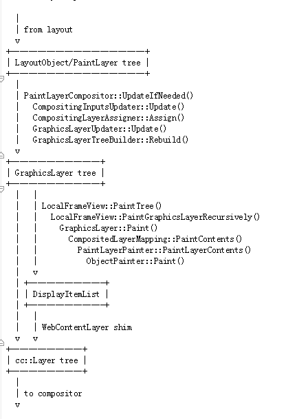
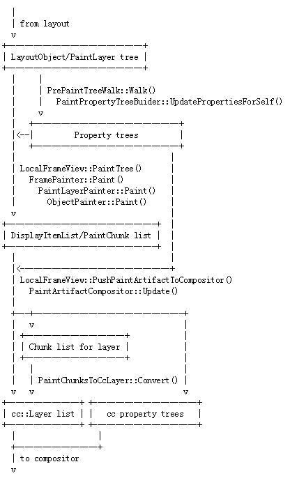
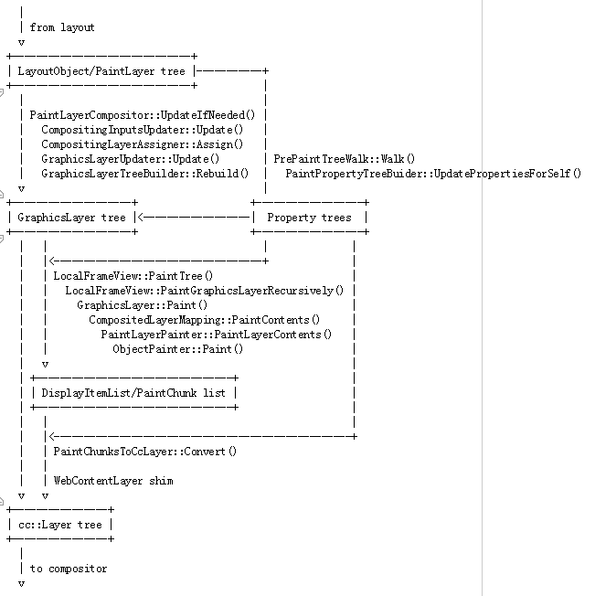
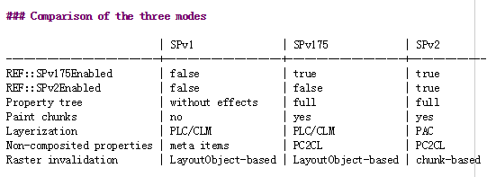

# Source/core/paint

对，这是一篇[翻译](https://cs.chromium.org/chromium/src/third_party/WebKit/Source/core/paint/README.md)！

这个目录包含了layout object的painter的实现。包含了以下几个生命周期：

*   Layerization (`kInCompositingUpdate`, `kCompositingInputsClean` and `kCompositingClean`)
*   PaintInvalidation (`InPaintInvalidation` and `PaintInvalidationClean`)
*   PrePaint (`InPrePaint` and `PrePaintClean`)
*   Paint (`InPaint` and `PaintClean`)

## 术语

### stacked element 和 stacking context

基本上是基于[CSS 2.1 appendix E. Elaborate description of Stacking Contexts](http://www.w3.org/TR/CSS21/zindex.html).

这里为了与文档一致，用element代替object。

根据上面那个文档，我们有以下几种类型的element，在painting的时候被区别对待：

- stacked element： 在stacking context中被z-ordered的objects，包含：
  - stacking context：非auto z-indices或带有其他可以影响stacking的属性（transform, opacity, blend-mode）的elements。

  - 不是真的stacking contexts，但被当成stacking contexts（不管其孩子的paint）的element。他们的z-ordering由真的stacking context管理。他们是z-index: auto的positioned element。

    他们要被当成enclosing stacking context管理，是因为：z-index: auto 和 z-index: 0在stacking context排序中被认为是等价的，他们可能和dom order不一致。

    这种类型的stacked element和真的stacking context的区别在于：不管理孩子节点的z-ordering。它的孩子节点由这个stacked element的parent stacking context管理

  stacked element代表在stacking context里参与z-index排序的element。

  `PaintLayerStackingNode`代表stacked element，带有一个`PaintLayer`。由 self-painting `PaintLayer`的    `PaintLayerPainter` paint。第二种的stacked element不负责绘制自己的孩子，由其父亲负责。

- Non-stacked pseudo stacking contexts：此类element非stacked，但像stacking context一样由自己负责paint其子孙节点（除了stacked element）：

  - inline blocks, inline tables, inline-level replaced elements
  - non-positioned floating elements (E.2.5 in the documentation)
  - [flex items](http://www.w3.org/TR/css-flexbox-1/#painting)
  - [grid items](http://www.w3.org/TR/css-grid-1/#z-order)
  - custom scrollbar parts

  `ObjectPainter::paintAllPhasesAtomically()`负责paint所有painting算法中的步骤，除了non-auto和positioned孩子。

- 其它普通的element
###  其它术语

- paint container: paiting object的父亲节点，见定义[CSS2.1 spec for painting](([http://www.w3.org/TR/CSS21/zindex.html](https://www.google.com/url?q=http://www.w3.org/TR/CSS21/zindex.html)). 普通的object，就是其dom上的父亲节点。对于stacked object，是stacking context的包含节点。

- Paint container chain: element和root之间的链。

- compositing container: blink内部用paintlayer来代表一些object。compositing container是在Paint container chain上，拥有paintlayer的object。实现的地方`PaintLayer::compositingContainer()`。可以当成一个跳过普通object，直接获取the containing stacked object的方法。

- Compositing container chain: Compositing container的祖先链。

- Paint invalidation container: 在Compositing container chain上，最近的object。spv2没有这个概念。

- visual rect： display item client绘制的区域

## overview

这个模块主要职责是把layout的output（layout object tree）转换成compositor的input（`cc::layer` tree和相关的display item）。

有三种操作方式，由`RuntimeEnabledFeatures`控制。

### SlimmingPaintV1 (a.k.a. SPv1, SPv1.5, old-world compositing)

这是默认的模式。在这个模式中，分层（layerization ）跑在pre-paint和paint之前。 `PaintLayerCompositor` 和 `CompositedLayerMapping` 利用layout和style信息决定那个paintlayer tree的子树需要拉出来在自己的层里绘制，这个过程叫做：'being composited'. Transforms, clips, 和 effects会encloseing子树，这个subtree会有个`GraphicsLayer`的参数。

然后，在pre-paint时，会生成一个property tree。作用是为了invalidation，为layout object快速计算在其backing layer上的paint location和visual rect。

在paint时，每个`GraphicsLayer`的paint function由`CompositedLayerMapping`创建出来，这些paint function会被调用，进而调用进每个paintlayer的subtree的painter中。这些painter输出ldisplay item（可能是drawing）或者meta display items（代表非composited的transforms, clips 和effects）的list。



### SlimmingPaintV2 (a.k.a. SPv2)

这个新的模式还在开发中。在这个模式中，分层（layerization ）跑到pre-paint和paint之后；而且在property tree的帮助下，meta display item被弃用了。

整个流程，由pre-paint开始，这个过程将生成property tree.

在paint时，每个生成的display item将和一个property tree state相关联。相邻的且拥有一样的property tree status的display item被分组成一个叫做`paintChunk`的东西。然后，`PaintArtifactCompositor`利用`paintChunk list` 进行分层(`layerization`)。 被composited的property node被转换成cc property node, 而非composited的property nodes被转换成meta display item（`PaintChunksToCcLayer`）。（what？！不是弃用了吗？！）



### SlimmingPaintV175 (a.k.a. SPv1.75)

这个模式逐步开放spv2的已完成的特性。1.75是因为，用property tree invalidation被叫做1.5，现在已是1.0的一部分了。spv1.75完成后将代替spv1。

spv1.75复用spv1的分层（layerization），将使用spv2的property tree based paint。在property tree的帮助下，meta display item被弃用了。（Meta display items are abandoned in favor of property tree. 这样翻译不对吗？）

每个drawable GraphicsLayer's layer state 将由property tree builder计算生成。在paint时，每个display item与一个property tree state关联。在paint结束时，meta display items由chunk和layer之间不同的state生成。



### Comparison of the three modes



## PaintInvalidation (Deprecated by [PrePaint](#PrePaint))

Paint invalidation用于标志任何与上次cached painting中不同的东西。

Paint invalidation在document生命周期中，位于compositing update之后，paint之前。在compositing update时，objects被标志需要paint invalidation checking，如果它的style\layout\compositing等发生变化了。在paint invalidation阶段，为了标志subtree和object将前序遍历layout tree，跨frame，并发送以下信息给`GraphicsLayer`s 和`PaintController`：

- invalidated display item clients：必须invalidate所有需要重新生成display item的display item clients
- paint invalidation rects: 必须包含所有将生成不同pixels的区域。他们由display item clients的visual rect生成。

### `PaintInvalidationState`

`PaintInvalidationState`是一个用于paint invalidation阶段的optimization。在paint invalidation遍历树之前，root `LayoutView`将生成一个root `PaintInvalidationState`. 在遍历树的过程中，每个object将基于其父亲节点传过来的`PaintInvalidationState`都会创建一个自己的`PaintInvalidationState`。`PaintInvalidationState`跟踪以下信息：

- Paint invalidation container: 因为stacked object的Paint invalidation container和其它object不一样，这里不得不分开跟踪。比如:

  ```
          <div style="overflow: scroll">
              <div id=A style="position: absolute"></div>
              <div id=B></div>
          </div>
  ```

  如果scroller是composited的（for high-DPI screens for example），scroller是b的Paint invalidation container，不是a的。

- Paint offset and clip rect: 如果可能，`PaintInvalidationState`会累加paint invalidation container的paint offsets 和 overflow clipping rects，用于提供时间复杂度为O(1)的换算本地point或rect到paint invalidation container的空间。由于absolute-positioned object的containing block不同，在跟踪时，对其区别对待。

  对于不可能跟踪的情况，将使用`LayoutObject::localToAncestorPoint()`或`LayoutObject::mapToVisualRectInAncestorSpace()`计算paint offsets 和 clipping rects。以下情况需要用到上面的处理方式：

  *   An object has transform related property, is multi-column or has flipped
      blocks writing-mode, causing we can't simply accumulate paint offset for
      mapping a local rect to paint invalidation container;
  *   An object has has filter (including filter induced by reflection), which
      needs to expand visual rect for descendants, because currently we don't
      include and filter extents into visual overflow;
  *   For a fixed-position object we calculate its offset using
      `LayoutObject::localToAncestorPoint()`, but map for its descendants in
      fast-path if no other things prevent us from doing this;
  *   Because we track paint offset from the normal paint invalidation container
      only, if we are going to use
      `m_paintInvalidationContainerForStackedContents` and it's different from the
      normal paint invalidation container, we have to force slow-path because the
      accumulated paint offset is not usable;
  *   We also stop to track paint offset and clipping rect for absolute-position
      objects when `m_paintInvalidationContainerForStackedContents` becomes
      different from `m_paintInvalidationContainer`.

### Paint invalidation of texts

`InlineTextBoxPainter` 负责text的paint， `InlineTextBoxPainter`的display item client是`InlineTextBox`. text的background 和 mask由`InlineTextFlowPainter`paint，其display item client 是 `InlineFlowBox`. 若他们的paint发送变化，这些display item client的invalidate将被触发。

若style变化，`LayoutInline`s 和`LayoutText`s将被标志成full paint invalidation。在paint invalidation过程中，直接在`LayoutInline::InvalidateDisplayItemClients()`invalidate LayoutInline的 InlineFlowBox和在`LayoutInline::InvalidateDisplayItemClients()`中invalidate LayoutText 的InlineTextBox。不需要遍历`InlineFlowBox`的子树，因为它们会自己处理。（omg，我翻译的是啥？！）

### Specialty of `::first-line`

略

## PrePaint (Slimming paint invalidation/v2 only)

[`PrePaintTreeWalk`](https://cs.chromium.org/chromium/src/third_party/WebKit/Source/core/paint/PrePaintTreeWalk.h)

在pre-paint阶段，`PrePaintTreeWalk`将会遍历整个layout tree。在遍历过程中，做了以下这些事情：

### Building paint property trees

[`PaintPropertyTreeBuilder`](https://cs.chromium.org/chromium/src/third_party/WebKit/Source/core/paint/PaintPropertyTreeBuilder.h)

这个类负责建立property tree（见：[the platform paint README file](https://cs.chromium.org/chromium/src/third_party/WebKit/Source/platform/graphics/paint/README.md)）

每个`PaintLayer`的`LayoutObject`有一个或多个`FragmentData` object. 每个`FragmentData`有一个`ObjectPaintProperties` object代表它拥有property nodes。比如：一个拥有transform的object，它的`ObjectPaintProperties::Transform()`将是`TransformPaintPropertyNode`。

   `NeedsPaintPropertyUpdate`, `SubtreeNeedsPaintPropertyUpdate`和`DescendantNeedsPaintPropertyUpdate`这些dirty bits控制每次PrePaintTreeWalk时，遍历layout tree要走多深。

### Fragments

不管multicolumn/pagination的情况下，self-painting `PaintLayer`s 和`FragmentData`是1：1的。

如果存在multicolumn/pagination，可能会有多个`FragmentData`。

如果`paintlayer`有一个property node，它的每个fragmentData也都会有一个。

fragment父亲节点的property node是父paintlayer的property node。比如：For example, if there are 3 columns and both a parent and child `PaintLayer` have a transform, there will be 3 `FragmentData` objects for the parent, 3 for the child, each `FragmentData` will have its own `TransformPaintPropertyNode`, and the child's ith fragment's transform will point to the ith parent's transform.

每个fragmentdata都会收到自己的`ClipPaintPropertyNode`.他们包含独一的`PaintOffset, `PaginationOffset 和`LocalBordreBoxProperties` object.

### Paint invalidation

[`PaintInvalidator`](https://cs.chromium.org/chromium/src/third_party/WebKit/Source/core/paint/PaintInvalidator.h)

在SlimmingPaintInvalidation中，这个class代替了`PaintInvalidationState`。主要的区别在PaintInvalidator, visual rects 和 locations由 `GeometryMapper`计算出来，基于`PaintPropertyTreeBuilder`产生的paint properties。

## paint

### paint result caching

`PaintController`把上次paint的结果保存在一个display item cache中。若painter生成的结果跟上次一样，就复用cache中的display item。

### display item caching

当painter创建的`DrawingDisplayItem` 和上次的一样，复用。

#### Subsequence caching

可能的话，在`PaintLayerPainter::PaintContents()`时，会创建一个scoped `SubsequenceRecorder`，来record所有在这个scope中生成的display item，被当成"subsequence"。在paint layer之前，如果可以确认layer即将生成的display items跟以前一样，讲复用整个subsequence。

有很多条件会影响到：

- 是否需要给paintlayer生成subsequence
- 是否可复用paintlayer中的subsequence
- 在`ShouldCreateSubsequence()` and `shouldRepaintSubsequence()` in`PaintLayerPainter.cpp` 有详细定义

### Empty paint phase optimization

在paint过程中，由于多个paint阶段我们需要遍历好几次layout tree。有时一个层中，没有需要在某个paint phase中绘制的内容，此时，将会跳过这部分树的遍历。有`PaintPhaseDescendantBlockBackgroundsOnly`, `PaintPhaseDescendantOutlinesOnly`和 `PaintPhaseFloat`控制空绘制阶段。

在paint invalidation过程中，通过设置self-painting layer的`NeedsPaintPhaseXXX`标志出来该object在这个paint phase是否需要paint。

在paint过程中，先会check这些标志。

当一个layer不需要一个paint phase时，清空`NeedsPaintPhaseXXX`是很难的。所以，就不清空了。用另一个标志clipping,
scroll offset or interest rect代表该layer是否需要paint。此时，若PreviousPaintPhaseXXXWasEmpty设置了，将skip掉这个layer，不管`NeedsPaintPhaseXXX`设置的是啥。如果该层的clipping,scroll offset 或 interest rect有变化，`PreviousPaintPhaseXXXWasEmpty`将被清空。

如果layer被设置`NeedsRepaint`，`PreviousPaintPhaseXXXWasEmpty`不会被清空，只有相应的`NeedsPaintPhaseXXX`被设置时，才会清空这个标志。

当layer的结构发生变化的时候，不会invalidate 贴合changed subtree，我们需要手动更新`NeedsPaintPhaseXXX`。比如：一个object的style发生变化，创建了一个新的self-painting layer，此时，将拷贝其父亲layer的flags到这个新的layer，假设这个layer需要的paint phase和其父亲layer一样。

我们也可以在每个tree walk时都更新 `NeedsPaintPhaseXXX` ，但是这个会影响性能。spv2中，可以在pre-paint的tree walk中更新flag。


以上！！！


# paint 笔记

记录一下从LayoutBoxModelObject到cc::layer的流程：

- [src](https://cs.chromium.org/chromium/src/)/[third_party](https://cs.chromium.org/chromium/src/third_party/)/[WebKit](https://cs.chromium.org/chromium/src/third_party/WebKit/)/[Source](https://cs.chromium.org/chromium/src/third_party/WebKit/Source/)/[core](https://cs.chromium.org/chromium/src/third_party/WebKit/Source/core/)/[layout](https://cs.chromium.org/chromium/src/third_party/WebKit/Source/core/layout/)/

  [LayoutBoxModelObject](https://cs.chromium.org/chromium/src/third_party/WebKit/Source/core/layout/LayoutBoxModelObject.h?l=127&ct=xref_jump_to_def&gsn=LayoutBoxModelObject)::[CreateLayerAfterStyleChange](https://cs.chromium.org/chromium/src/third_party/WebKit/Source/core/layout/LayoutBoxModelObject.cpp?l=468&gs=kythe%253A%252F%252Fchromium%253Flang%253Dc%25252B%25252B%253Fpath%253Dsrc%252Fthird_party%252FWebKit%252FSource%252Fcore%252Flayout%252FLayoutBoxModelObject.cpp%2523XkXziN0yi31AdOsGSGWujPzseM8BjHrFPAZZEh3GCxw%25253D&gsn=CreateLayerAfterStyleChange&ct=xref_usages)()创建PaintLayer，是否需要创建PaintLayer 由PaintLayerType决定：

  - kNoPaintLayer

  - kNormalPaintLayer

  - // A forced or overflow clip layer is required for bookkeeping purposes,
    // but does not force a layer to be self painting.

    kOverflowClipPaintLayer

  - kForcedPaintLayer

- [PaintLayer](https://cs.chromium.org/chromium/src/third_party/WebKit/Source/core/paint/PaintLayer.h?l=222&ct=xref_jump_to_def&gsn=PaintLayer)::[EnsureCompositedLayerMapping](https://cs.chromium.org/chromium/src/third_party/WebKit/Source/core/paint/PaintLayer.cpp?l=2804&gs=kythe%253A%252F%252Fchromium%253Flang%253Dc%25252B%25252B%253Fpath%253Dsrc%252Fthird_party%252FWebKit%252FSource%252Fcore%252Fpaint%252FPaintLayer.cpp%2523cszslYKJ4bKtV%25252FUCbTV5Ywp0rSYWhdYGmLx5JKO%25252FJl8%25253D&gsn=EnsureCompositedLayerMapping&ct=xref_usages)() 为符合条件的paintlayer创建`composited_layer_mapping`

- [src](https://cs.chromium.org/chromium/src/)/[third_party](https://cs.chromium.org/chromium/src/third_party/)/[WebKit](https://cs.chromium.org/chromium/src/third_party/WebKit/)/[Source](https://cs.chromium.org/chromium/src/third_party/WebKit/Source/)/[core](https://cs.chromium.org/chromium/src/third_party/WebKit/Source/core/)/[paint](https://cs.chromium.org/chromium/src/third_party/WebKit/Source/core/paint/)/[compositing](https://cs.chromium.org/chromium/src/third_party/WebKit/Source/core/paint/compositing/)/

  CompositedLayerMapping构造时，会创建GraphicsLayer [CompositedLayerMapping](https://cs.chromium.org/chromium/src/third_party/WebKit/Source/core/paint/compositing/CompositedLayerMapping.h?l=87&ct=xref_jump_to_def&gsn=CompositedLayerMapping)::[CreatePrimaryGraphicsLayer](https://cs.chromium.org/chromium/src/third_party/WebKit/Source/core/paint/compositing/CompositedLayerMapping.cpp?l=263&gs=kythe%253A%252F%252Fchromium%253Flang%253Dc%25252B%25252B%253Fpath%253Dsrc%252Fthird_party%252FWebKit%252FSource%252Fcore%252Fpaint%252Fcompositing%252FCompositedLayerMapping.cpp%2523R1NjW7i5oZCtZqHcduVp%25252FKxj2zISJdJmrvwN%25252BII9iJc%25253D&gsn=CreatePrimaryGraphicsLayer&ct=xref_usages)()

- [src](https://cs.chromium.org/chromium/src/)/[third_party](https://cs.chromium.org/chromium/src/third_party/)/[WebKit](https://cs.chromium.org/chromium/src/third_party/WebKit/)/[Source](https://cs.chromium.org/chromium/src/third_party/WebKit/Source/)/[platform](https://cs.chromium.org/chromium/src/third_party/WebKit/Source/platform/)/[graphics](https://cs.chromium.org/chromium/src/third_party/WebKit/Source/platform/graphics/)/[GraphicsLayer.h](https://cs.chromium.org/chromium/src/third_party/WebKit/Source/platform/graphics/GraphicsLayer.h)

  GraphicsLayer构造时，创建WebConentLayer[layer_](https://cs.chromium.org/chromium/src/third_party/WebKit/Source/platform/graphics/GraphicsLayer.h?l=394&ct=xref_jump_to_def&gsn=layer_) [=](https://cs.chromium.org/chromium/src/buildtools/third_party/libc%2B%2B/trunk/include/memory?l=2411&ct=xref_jump_to_def&gsn=%3D) [Platform](https://cs.chromium.org/chromium/src/third_party/WebKit/public/platform/Platform.h?l=145&ct=xref_jump_to_def&gsn=Platform)::[Current](https://cs.chromium.org/chromium/src/third_party/WebKit/Source/platform/exported/Platform.cpp?l=178&ct=xref_jump_to_def&gsn=Current)()->[CompositorSupport](https://cs.chromium.org/chromium/src/third_party/WebKit/public/platform/Platform.h?l=558&ct=xref_jump_to_def&gsn=CompositorSupport)()->[CreateContentLayer](https://cs.chromium.org/chromium/src/third_party/WebKit/public/platform/WebCompositorSupport.h?l=60&ct=xref_jump_to_def&gsn=CreateContentLayer)(this);

- [src](https://cs.chromium.org/chromium/src/)/[third_party](https://cs.chromium.org/chromium/src/third_party/)/[WebKit](https://cs.chromium.org/chromium/src/third_party/WebKit/)/[public](https://cs.chromium.org/chromium/src/third_party/WebKit/public/)/[platform](https://cs.chromium.org/chromium/src/third_party/WebKit/public/platform/)/[WebContentLayer.h](https://cs.chromium.org/chromium/src/third_party/WebKit/public/platform/WebContentLayer.h)

  - 它的子类[src](https://cs.chromium.org/chromium/src/)/[cc](https://cs.chromium.org/chromium/src/cc/)/[blink](https://cs.chromium.org/chromium/src/cc/blink/)/[web_content_layer_impl.h](https://cs.chromium.org/chromium/src/cc/blink/web_content_layer_impl.h)
  - 拥有：[src](https://cs.chromium.org/chromium/src/)/[third_party](https://cs.chromium.org/chromium/src/third_party/)/[WebKit](https://cs.chromium.org/chromium/src/third_party/WebKit/)/[public](https://cs.chromium.org/chromium/src/third_party/WebKit/public/)/[platform](https://cs.chromium.org/chromium/src/third_party/WebKit/public/platform/)/[WebLayer.h](https://cs.chromium.org/chromium/src/third_party/WebKit/public/platform/WebLayer.h) [WebLayer](https://cs.chromium.org/chromium/src/third_party/WebKit/public/platform/WebLayer.h?l=61&ct=xref_jump_to_def&gsn=WebLayer)* [Layer](https://cs.chromium.org/chromium/src/third_party/WebKit/public/platform/WebContentLayer.h?l=39&gs=kythe%253A%252F%252Fchromium%253Flang%253Dc%25252B%25252B%253Fpath%253Dsrc%252Fthird_party%252FWebKit%252Fpublic%252Fplatform%252FWebContentLayer.h%2523KEnpoTLoaOx%25252F9vSLHyqsAfNoP4K3gx95HSPOc6cKNTo%25253D&gsn=Layer&ct=xref_usages)()。
    - WebLayer的子类[src](https://cs.chromium.org/chromium/src/)/[cc](https://cs.chromium.org/chromium/src/cc/)/[blink](https://cs.chromium.org/chromium/src/cc/blink/)/[web_layer_impl.h](https://cs.chromium.org/chromium/src/cc/blink/web_layer_impl.h)。
    - 拥有cc::[Layer](https://cs.chromium.org/chromium/src/cc/layers/layer.h?l=63&ct=xref_jump_to_def&gsn=Layer)* [CcLayer](https://cs.chromium.org/chromium/src/third_party/WebKit/public/platform/WebLayer.h?l=241&gs=kythe%253A%252F%252Fchromium%253Flang%253Dc%25252B%25252B%253Fpath%253Dsrc%252Fthird_party%252FWebKit%252Fpublic%252Fplatform%252FWebLayer.h%2523XmxO7stkSo%25252Bb1dfcQSTPqBuk3aVDU8UDTrYv3OphUsI%25253D&gsn=CcLayer&ct=xref_usages)()， cc下面的各种layer [src](https://cs.chromium.org/chromium/src/)/[cc](https://cs.chromium.org/chromium/src/cc/)/[layers](https://cs.chromium.org/chromium/src/cc/layers/)，比如：经常看到的：[src](https://cs.chromium.org/chromium/src/)/[cc](https://cs.chromium.org/chromium/src/cc/)/[layers](https://cs.chromium.org/chromium/src/cc/layers/)/[picture_layer.h](https://cs.chromium.org/chromium/src/cc/layers/picture_layer.h)

