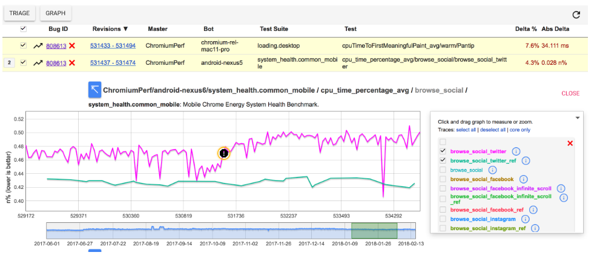
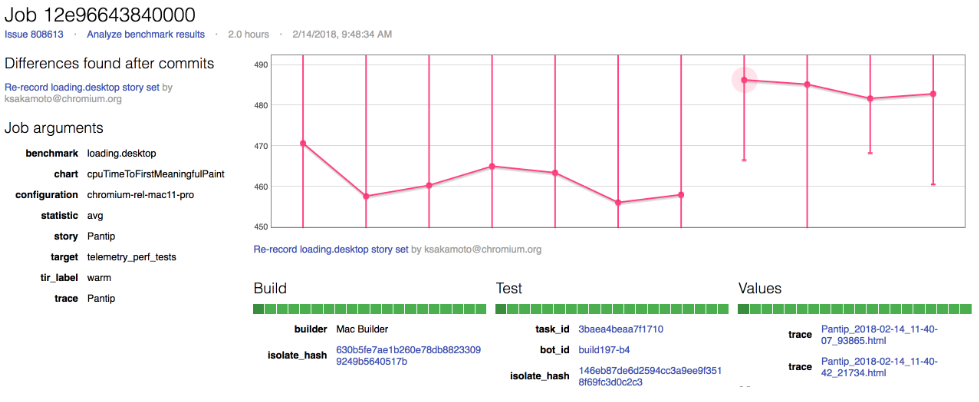

# Chromium是如何处理性能问题的

## 如何发现性能问题

[chromium.perf Waterfall](https://chromium.googlesource.com/chromium/src/+/master/docs/speed/perf_waterfall.md#Overview)负责跑性能测试用例，发现问题后生成相应的报告，并创建bug。bug上带者alert page信息。如：https://chromeperf.appspot.com/group_report?bug_id=XXX

Bot栏显示平台，Test显示某个测试用例，最后一栏给出性能影响的程度。

点击图片上的黑色感叹号，可以得到trace信息和锁定的提交范围等信息。

## 锁定引起问题的提交范围

bisect bots锁定引起问题的提交，并生成结果报告。格式如下：

**📍 Found significant differences after each of 2 commits.**
<https://pinpoint-dot-chromeperf.appspot.com/job/148a8d4e840000>

**Add smcgruer as an animations OWNER** by [flackr@chromium.org](mailto:flackr@chromium.org)
<https://chromium.googlesource.com/chromium/src/+/b091c264862d26ac12d932e84eef7bd5f674e62b>

**Roll src/third_party/depot_tools/ 0f7b2007a..fd4ad2416 (1 commit)** by [depot-tools-roller@chromium.org](mailto:depot-tools-roller@chromium.org)
<https://chromium.googlesource.com/chromium/src/+/14fc99e3fd3614096caab7c7a8362edde8327a5d>

Understanding performance regressions:
  <http://g.co/ChromePerformanceRegressions>

最重要的是第一个链接：the job detail page。

左边是bisect job的一些设置参数，右边图片是一个横轴代表提交记录，竖轴代表运行结果的图表。可以很好地定位具体是哪个提交引起的性能问题。

**这个页面的还有一个逆天的功能，可以上传修改后的patch，在用一样的测试环境，印证改修改是否有效。**

## 如何解决

开发同学有了以上的信息，确定是自己提交的代码引起的性能问题后。利用trace信息，分析test case，定位出问题，并修改。（讲起来挺容易，实际可能你要通宵好几天;)）

上传patch到job detail page，验证。

当然也可以本地搭建performance环境验证。

这套环境保证发现问题和验证问题环境设置相同，并完好保存信息，很大程度上减少开发同学本地搭建环境的痛苦，可以说对开发同学很友好了。

